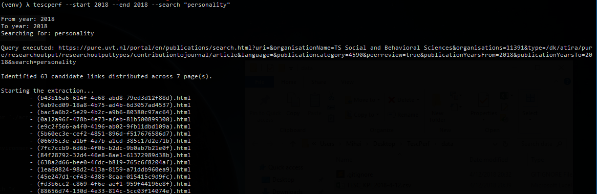
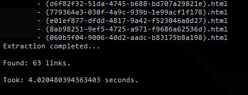
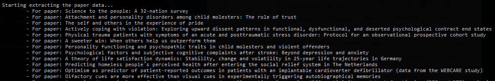
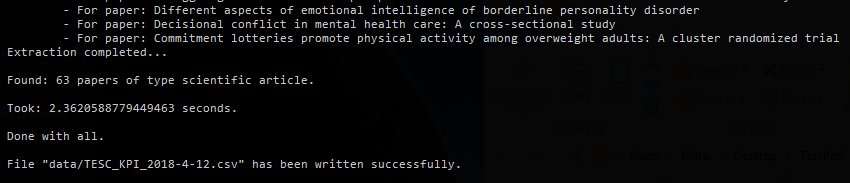
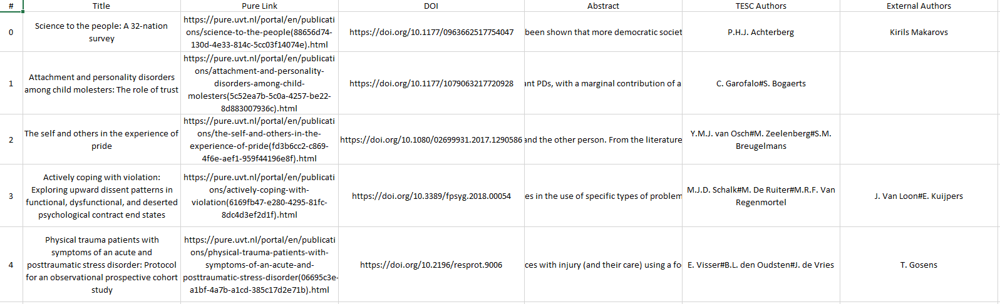

## Publishing KPIs for Tilburg Experience Sampling Center 

### Project description
- this project aims at identifying research papers published by researchers at Tilburg School of Social and Behavioral Sciences (TSB)
- publications are identified using the https://pure.uvt.nl/ portal, and for each paper a minimum amount of data is extracted (e.g., title, abstract, TSB authors, external authors etc.)
- the data is extracted from the `HTML` page of each publication (i.e., not from the `.pdf`, as **no files are being downloaded**)
- in essence, this project is a `web-scraping` tool with a command line interface implemented in `Python 3` in a multi-threaded fashion.
- main `Python` packages used:
	- [`Click`](https://github.com/pallets/click)
	- [`Beautiful Soup`](https://github.com/waylan/beautifulsoup)

### Installation
- **prerequisites:** `Python 3`, the `pip` package manager, and [`virtualenv`](https://github.com/pypa/virtualenv) need to be installed and available from your terminal
- **installation steps:**
	- clone the `git` repository and `cd` into `TescPerf`
	- create a virtual environment by running `virtualenv venv`
	- run `cd venv/Scripts` followed by `activate.bat` if you are on Windows, or `./activate` for Linux
	- run `cd ../..` to get back to the root directory of the project (i.e., no offense...)
	- install the project as a local `pip` package in your activated virtual environment running `pip install -e .`

### Usage
- the tool can be used as `tescperf --start <int:year> --end <int:year> --search "<str:query>"`
	- for instance, let's assume you are interested in the papers published in ***2018 alone***, containing the keyword ***personality*** (i.e., anywhere in the paper), then the command to run would look like this:
		- `tescperf --start 2018 --end 2018 --search "personality"`
		- the progress and the steps taken by the tool are printed to the console
		- more advanced search queries are also possible, as long as they are supported by the https://pure.uvt.nl portal (e.g., `^title:"personality" OR abstract:"personality"`)

### Tool procedure:
- the tool prints to the console the generated `URL` based on the input you provided (i.e., this `URL` serves as the starting point)
- the `HTML` document for this `URL` will contain a list of links to all publications identified, distributed across multiple pages
- the number of pages is inferred automatically, every page is opened, and the links to the actual pages of the publications are extracted

- when the link extraction phase is completed, the number of successfully extracted links and the elapsed time are printed to the console

- next, the tool opens every extracted link and parses the `HTML` looking for publication-specif data. During this, the title is printed to the console

- when the tool finished extracting the data for all the publications, the number of successful extractions is printed to the console along side the time that was needed

- finally, a `.csv` containing the data is written to `data/` in the project root directory

- ***note:*** in case there are multiple authors, they are collapsed into a single string, with each author delimited by an `#`
	- e.g., `Author One#Author Two#Author Three#Author four`
	- you can easily obtain an iterable data structure by splitting the string by `#` 

### Testing
- currently only a small portion of the tool is covered with tests
	- you can run `py test_tesc_helpers.py`
- `test_tesc_workers.py` is *work in progress*

### Contact
- if you have any questions regarding this tool feel free to drop me a line at m.a.constantin@uvt.nl
